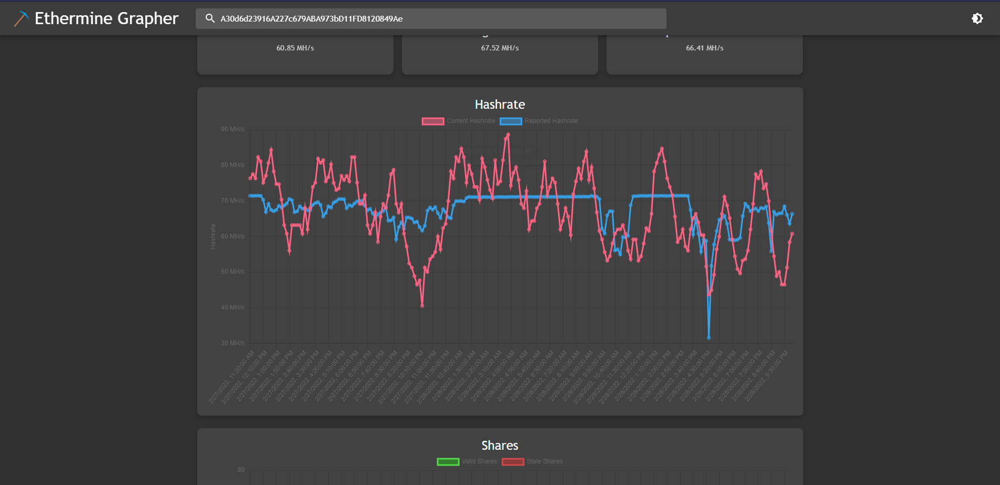
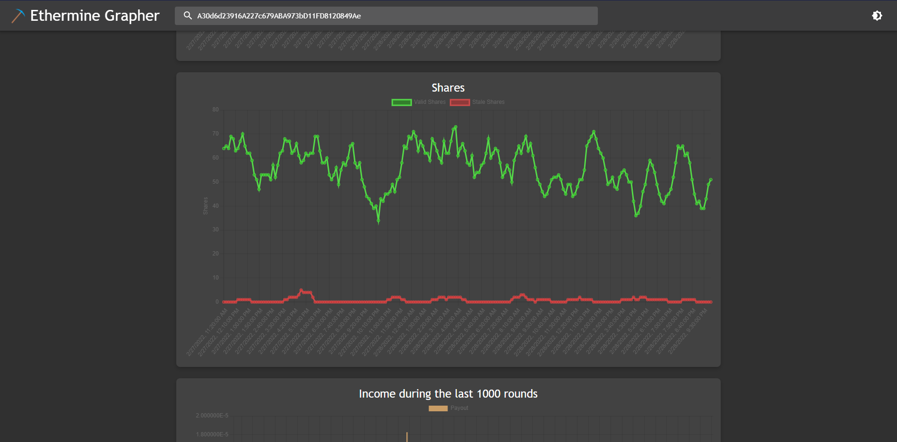
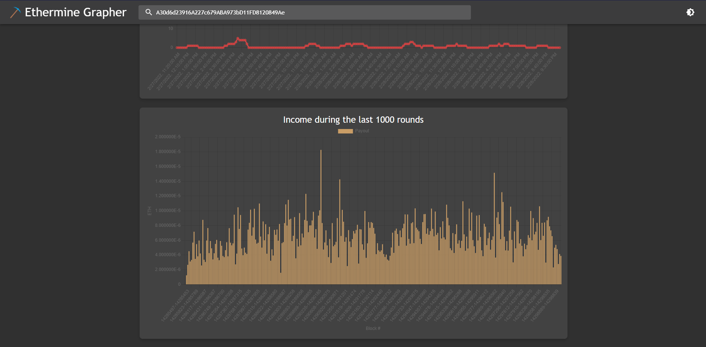

# EthermineGrapher
This web-app is purely frontend built. It's intended use is to have a better view of the hashrate, share and payout graphs for each miner address by using lighter and more comfortable colours. Similar to the original [Ethermine](https://ethermine.org) website... it has light and dark mode! :D

[Ethermine Api](https://ethermine.org/api/pool)
## How to use
If you already have an Ethereum miner address, enter it into the search bar and it will take you to the miner dashboard.

Note: This is intended for mining on the ethermine pool, hence only data will display for miners currently working within this pool.

## Chart Examples
Here is a preview using my current mining setup (which is just my current pc).

### Hashrate Chart

### Shares Chart

### Income Chart

